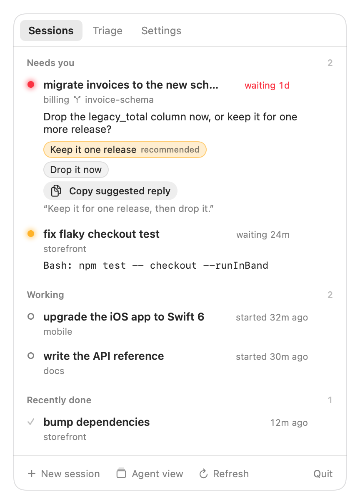
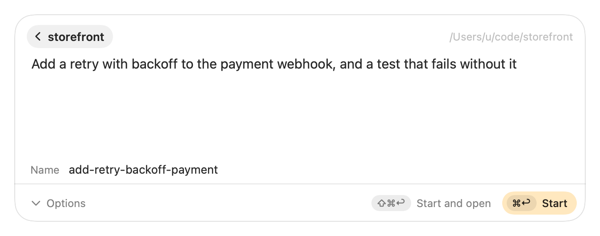
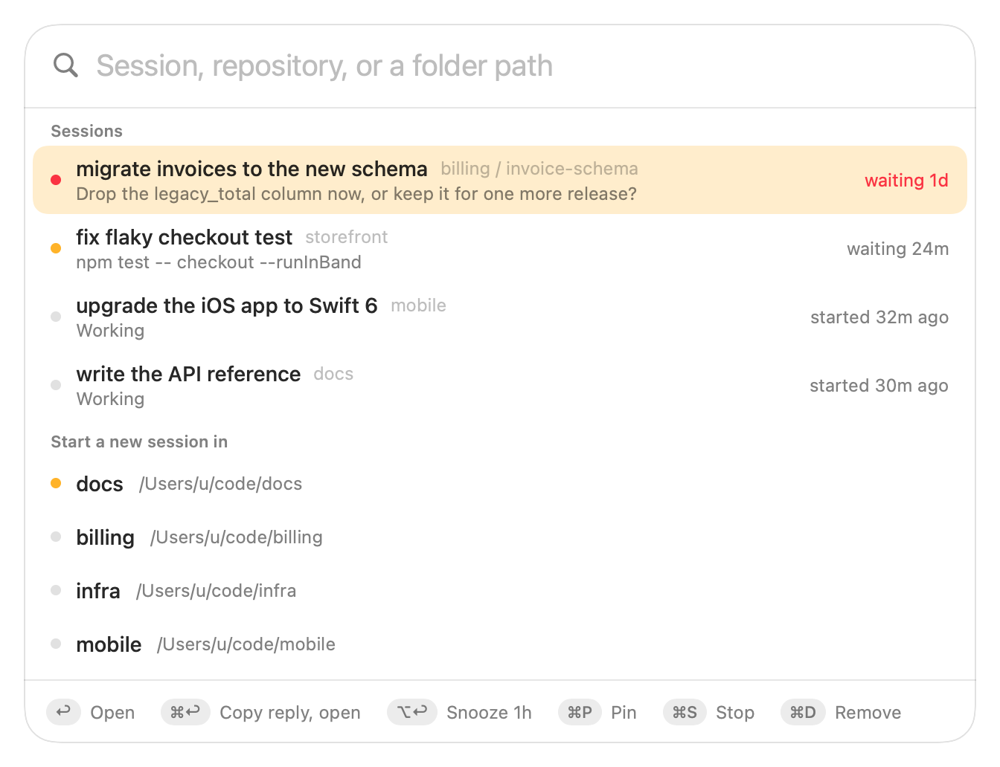
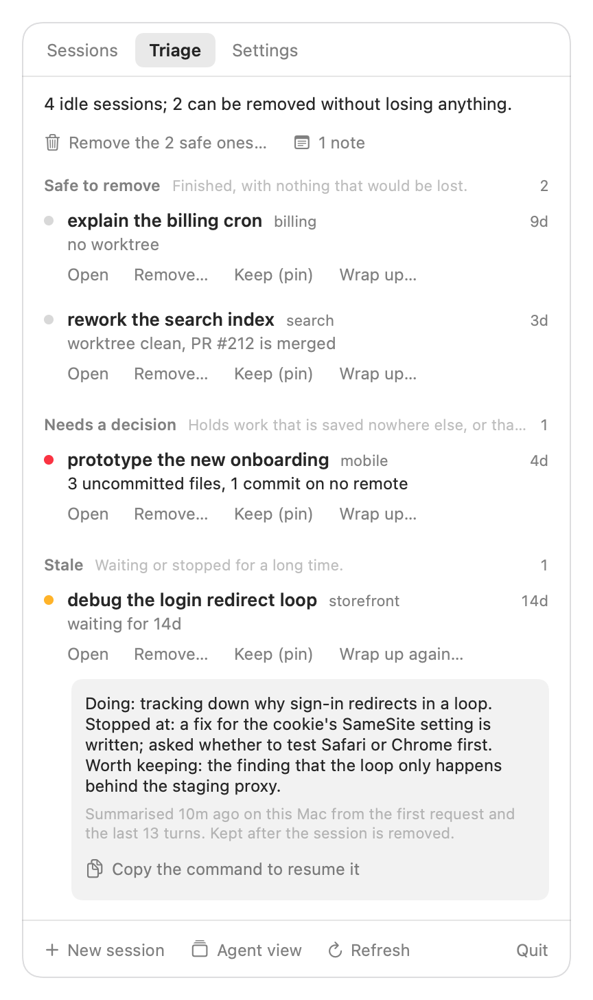
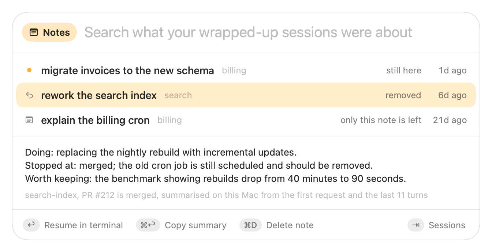

<p align="center">
  
</p>

<h1 align="center">Porchlight</h1>

<p align="center">
  <b>Leave the light on for your Claude Code sessions.</b><br>
  A macOS menu-bar app that shows which background sessions are waiting on you,<br>
  reminds you until you answer, and helps you clear out the ones you are done with.
</p>

<p align="center">
  <picture>
    <source media="(prefers-color-scheme: dark)" srcset="docs/images/panel-dark.png">
    
  </picture>
</p>

[Claude Code](https://code.claude.com) can run sessions in the background. That is the easy part.
The hard part is noticing that one of them stopped an hour ago to ask you something, and
remembering what the twelve finished ones were for. Porchlight is for that.

It works with the `claude` you already have. It never replaces agent view, and removing it loses
nothing.

## What it does

### Shows who is waiting, and what they asked

The lantern in your menu bar is dark when nothing needs you, amber when a session is waiting, and
red when one has waited too long. Click it for the list: the question each session asked, its
options, and the command it wants approved. One click opens the session in your terminal, with the
suggested reply ready to paste.

### Reminds you until you answer

A session that keeps waiting gets a notification after 15 minutes, again with sound after two
hours, then every four. Snooze one for an hour or until tomorrow, set quiet hours, and get one
summary each morning. All of the times are yours to change.

### Starts a session from anywhere

<p align="center">
  <picture>
    <source media="(prefers-color-scheme: dark)" srcset="docs/images/palette-prompt-dark.png">
    
  </picture>
</p>

Press your shortcut in any app, type a few letters of a repository, write what Claude should do,
and press ⌘Return. The session starts in the background, named from your prompt. Porchlight finds
your repositories once you tell it where your code lives.

The same palette lists your sessions, the waiting ones first, so the shortcut is also the fastest
way to answer one:

<p align="center">
  <picture>
    <source media="(prefers-color-scheme: dark)" srcset="docs/images/palette-dark.png">
    
  </picture>
</p>

### Tells you which sessions can go

<p align="center">
  <picture>
    <source media="(prefers-color-scheme: dark)" srcset="docs/images/triage-dark.png">
    
  </picture>
</p>

Sessions pile up. The Triage tab looks at each idle one and says where it stands:

- **Safe to remove:** finished, its worktree is clean, its pull request is merged.
- **Needs a decision:** it holds uncommitted files or commits that exist nowhere else.
- **Stale:** it has been waiting on you for a week or more.
- **Keep:** its pull request is still open.

"Remove the safe ones" clears the first group in one go. Claude Code checks each one again and
refuses if anything would be lost; Porchlight never overrides that without asking you twice.

### Remembers what a session was about

Before you remove an old session, **Wrap up** has a model summarise it: what it was doing, where it
stopped, and what would be lost. The summary is kept as a note after the session is gone.

- **On this Mac**, with Apple's on-device model: free, and nothing leaves your computer.
- **With Claude**, when you want the whole conversation read: it asks first, since it uses some of
  your Claude usage.

Press Tab in the palette to search your notes and read them with the arrow keys. Return reopens the
conversation if Claude Code still has it.

<p align="center">
  <picture>
    <source media="(prefers-color-scheme: dark)" srcset="docs/images/notes-dark.png">
    
  </picture>
</p>

### Keeps the sessions you mean to keep

Pin a session you use on purpose for days or weeks. Pinned sessions stay at the top, are never
offered for removal, and can have their reminders turned off when waiting for you is their normal
state.

## Install

With [Homebrew](https://brew.sh):

```sh
brew trust --formula ksawerykarwacki/porchlight/porchlight
brew tap ksawerykarwacki/porchlight https://github.com/ksawerykarwacki/porchlight.git
brew install --HEAD porchlight
brew services start porchlight     # start now, and at every login
```

Homebrew builds Porchlight from source on your Mac, which takes a few minutes and needs the Xcode
Command Line Tools. The first time you open the panel, a short checklist walks you through the
rest: where your repositories live, a shortcut, notifications.

**You need** macOS 14 or later and Claude Code 2.1.294 or later. Summaries on your Mac need
Apple Intelligence and the `fm` tool that comes with recent macOS (checked on macOS 27); without
them, summaries go through Claude.

To update, use **Update and restart** on the Settings tab. To remove it:
`brew services stop porchlight && brew uninstall porchlight`.

## Good to know

- **It only watches and opens.** Porchlight never types into a session or answers for you. A reply
  is copied for you to paste.
- **Nothing is deleted behind your back.** Stopping and removing always ask first, and tell you
  what the session's worktree still holds.
- **It is local.** No account, no server, no telemetry. See [Privacy](docs/guide.md#privacy) for
  exactly which files it reads.
- **Your terminal, your way.** Warp, iTerm2, Terminal, WezTerm and Ghostty are supported; with anything
  else the command is put on your clipboard. `porchlight tab` gives you one terminal tab that
  follows your clicks.
- **Two optional Claude Code mods.** [`porchlight-companion`](mods/companion/README.md) tells the
  app the moment a session asks something, and lets you answer a question that has options from
  the panel or, without leaving the keyboard, from the palette. [`porchlight-wake`](mods/wake/README.md) wakes a background session that has stopped
  before another session's message is sent to it; it works without the app.
- **There is a command line too.** `porchlight status`, `dispatch`, `triage`, `wrap-up`, `notes`
  and more, with JSON output for scripts.

Porchlight is a young project, built by one person for their own use. It is open source so that
you can read what it does, change it, and say what is missing.

## Learn more

- **[The guide](docs/guide.md):** reminders, the palette, Triage, notes, terminals, every setting
  and command.
- **[Contributing](CONTRIBUTING.md):** how to build and test it, and the rules it follows.
- **[The specification](spec.md):** the design, and what has and has not been verified.

## Porchlight and Claude Code

Porchlight is an independent project. It is not affiliated with, endorsed by, or sponsored by
Anthropic. "Claude" and "Claude Code" are Anthropic's trademarks, used here only to say what
Porchlight works with. It runs the `claude` program you installed yourself, unmodified, and never
reads or stores your Claude sign-in. Your use of Claude Code stays subject to Anthropic's terms.

## License

Free software, copyright © 2026 Ksawery Karwacki, under the
[GNU General Public License](LICENSE), version 3 or later. You may use, study, change and share it;
if you distribute it or a changed version, you must do so under the same licence with the source.
It comes with no warranty.
